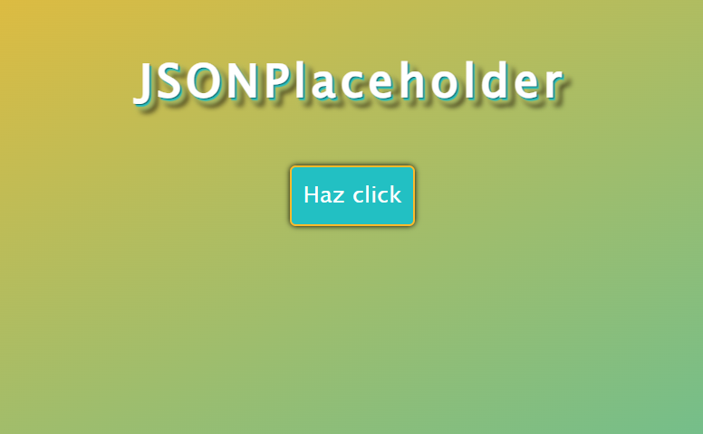

<h1>APIs públicas con JavaScript</h1>

Una API pública es un servicio en internet que devuelve información en formato JSON.

Puede ser una API que devuelva chistes, frases, usuarios ficticios, etc.

<h2>Ejercicio usuario ficticio con fetch:</h2>

<ul>
    <li>Cuando la persona pulse un botón en tu página, se hará una petición a la API de JSON Placeholder</li>
    <li>La URL que debes usar es: <b>https://jsonplaceholder.typicode.com/users/1</b></li>
    <li>La API devuelve un objeto JSON con varios datos:
        <ul>
            <li>Nombre: name</li>
            <li>Email: email</li>
        </ul>
    </li>
    <li>Mostrar en pantalla el nombre y email</li>
    <li>Si ocurre algún error en la petición (por ejemplo, no hay conexión o la API responde mal), la promesa debe rechazar y mostrar un mensaje de error en pantalla</li>
    <li>El mensaje debe aparecer dentro de un elemento del HTML (no solo en consola)</li>
</ul>

 
<a href="https://codepen.io/loli-gf/pen/dPYQENd">Enlace a CodePen</a>